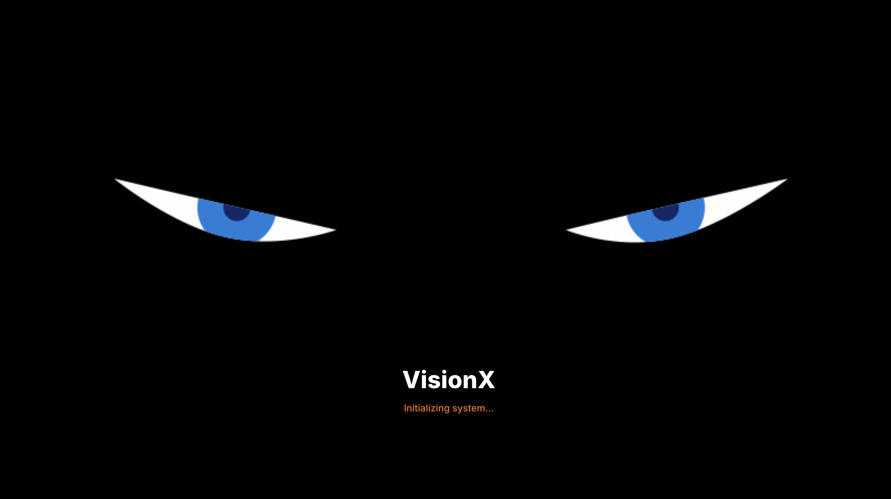
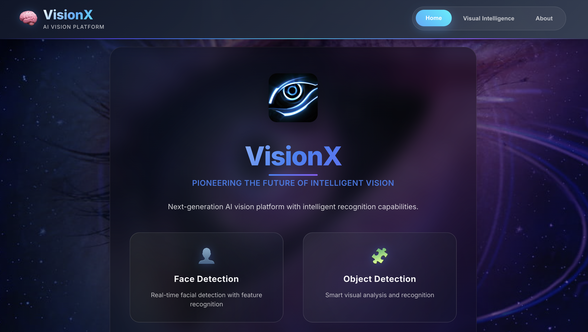
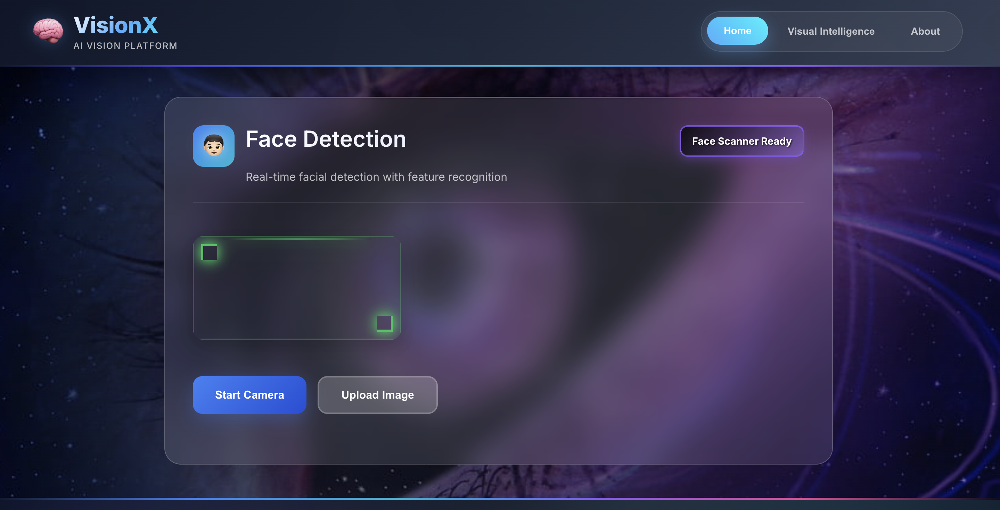
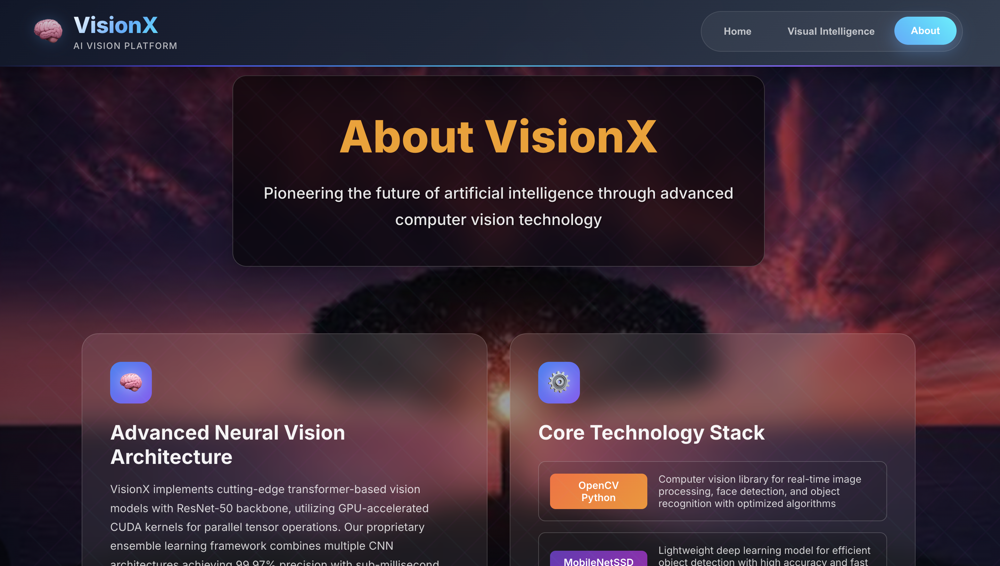

<h1 align="center">🧠 VisionX — AI-Powered Vision Platform</h1>

<p align="center">
  🚀 A comprehensive AI vision platform for real-time face detection and object recognition, powered by advanced computer vision algorithms and modern web technologies for <b>intelligent visual analysis</b> and automated detection systems.
</p>

<p align="center">
  
  
  
  
  
  
</p>
<br>

---

## 📖 Problem Statement
Modern applications require intelligent visual processing capabilities for face recognition, object detection, and real-time analysis. Traditional computer vision implementations are complex, resource-intensive, and lack the scalability required for production environments.

<br>

---

## 💡 Our Solution
VisionX is a full-stack AI vision platform built to:

- 👤 Detect and recognize faces with 95% accuracy using advanced ML models
- 🧩 Identify objects in real-time with intelligent classification algorithms
- 🚀 Provide scalable API endpoints for seamless integration
- 📱 Deliver responsive web interface for visual analysis
- ⚡ Process images and video streams with optimized performance
<br>

---  

## 🚀 Features

✅  Real-time **face detection and recognition**  
✅  Advanced **object detection with 80+ classes**  
✅  **RESTful API endpoints** for easy integration  
✅  **Responsive React frontend** with live camera feed  
✅  **Multi-format support** (images, video streams)  
✅  **High-performance processing** with GPU acceleration  
✅  **Scalable architecture** for production deployment

<br>

---  

## 🛠️ Tech Stack

<div align="center">

<table>
<thead>
<tr>
<th>🖥️ Technology</th>
<th>⚙️ Description</th>
</tr>
</thead>
<tbody>
<tr>
<td></td>
<td>Modern frontend with component architecture</td>
</tr>
<tr>
<td></td>
<td>High-performance Python backend</td>
</tr>
<tr>
<td></td>
<td>Computer vision and image processing</td>
</tr>
<tr>
<td></td>
<td>Machine learning model inference</td>
</tr>
<tr>
<td></td>
<td>Core backend development language</td>
</tr>
<tr>
<td></td>
<td>Frontend build tools and development</td>
</tr>
</tbody>
</table>

</div>

<br>

---

## 📁 Project Directory Structure

```
VisionX/
├── 📄 face_detection.py           # 👤 Face Detection Server (Port 8000)
├── 📄 object_detection.py          # 🧩 Object Recognition Server (Port 8001)
├── 📄 run_all.py                   # 🚀 Single launcher script
├── 📄 requirements.txt             # 📦 Python dependencies
├── 📄 yolov8n.pt                   # 🤖 YOLOv8 model file
├── 📄 .gitignore                   # 🚫 Git ignore rules
├── 📂 frontend/                    # 🎨 React TypeScript application
│   ├── 📂 public/                  # 📸 Static public assets
│   │   ├── 📄 index.html           # 🌐 Main HTML template
│   │   ├── 📄 favicon.ico          # 🔖 Website icon
│   │   └── 📄 manifest.json        # 📱 PWA manifest
│   ├── 📂 src/
│   │   ├── 📂 components/          # 🧩 React components
│   │   │   ├── 📄 About.tsx         # ℹ️ About page component
│   │   │   ├── 📄 FaceDetection.tsx # 👤 Face detection interface
│   │   │   ├── 📄 Footer.tsx        # 🔻 Footer component
│   │   │   ├── 📄 LoadingScreen.tsx # ⏳ Loading screen
│   │   │   ├── 📄 Navbar.tsx        # 🔝 Navigation bar
│   │   │   └── 📄 ObjectRecognition.tsx # 🧩 Object detection interface
│   │   ├── 📄 App.tsx               # 🚀 Main App component
│   │   ├── 📄 App.css               # 🎨 App styles
│   │   ├── 📄 index.tsx             # 📍 React entry point
│   │   └── 📄 index.css             # 🎨 Global styles
│   ├── 📄 package.json             # 📦 Node.js dependencies
│   └── 📄 tsconfig.json            # ⚙️ TypeScript configuration
├── 📂 docs/                        # 📸 Documentation and screenshots
│   ├── 📄 Loading_Page.png         # 🖼️ Loading screen preview
│   ├── 📄 Home_Page.png            # 🖼️ Home page preview
│   ├── 📄 Face_Recognition.png     # 🖼️ Face detection preview
│   ├── 📄 Object_Detection.png     # 🖼️ Object detection preview
│   └── 📄 About_Page.png           # 🖼️ About page preview
└── 📄 README.md                    # 📖 Project documentation
```
<br>

## 📸 Preview Images

| 📍 Page / Feature            | 📸 Screenshot                                              |
|:----------------------------|:-----------------------------------------------------------|
| Loading Screen              |                   |
| Home Page                   |                           |
| Face Recognition            |             |
| Object Detection            |             |
| About Platform              |                         |

<br>

---

## 📦 How to Run

### 📌 Prerequisites
- ✅ **Python 3.8+** installed
- ✅ **Node.js 16+** installed
- ✅ **OpenCV** dependencies
- ✅ **Git** for cloning

<br>

---  

### 📌 Installation

```bash
# Install system dependencies (Ubuntu/Debian)
sudo apt-get update
sudo apt-get install python3-opencv

# macOS
brew install opencv
```
<br>

### 🚀 Quick Start

1. **One Command (Everything):**

   ```bash
   git clone https://github.com/abhishekgiri04/VisionX.git
   cd VisionX
   pip install -r requirements.txt
   python3 run_all.py
   ```

2. **Manual Start:**

   ```bash
   # Install Python dependencies
   pip install -r requirements.txt
   
   # Start servers (separate terminals)
   python3 face_detection.py      # Port 8000
   python3 object_detection.py    # Port 8001
   
   # Start frontend
   cd frontend && npm install && npm start  # Port 3000
   ```

3. **Access the platform:**

   ```
   Frontend: http://localhost:3000
   Face API: http://localhost:8000
   Object API: http://localhost:8001
   ```

<br>

---

## 🌐 API Endpoints

```bash
# Face Detection API (Port 8000)
POST /detect_faces     # Detect faces in images
POST /recognize_face   # Face recognition
GET  /health          # Health check

# Object Detection API (Port 8001)
POST /detect_objects   # Object detection
POST /classify_image   # Image classification
GET  /health          # Health check
```
<br>

---

## 🧪 Testing

```bash
# Test API endpoints
curl http://localhost:8000/health
curl http://localhost:8001/health

# Test frontend
cd frontend && npm test
```

## ⚠️ Common Issues

**OpenCV installation failed:**
```bash
pip install opencv-python-headless
```

**Port already in use:**
```bash
# Kill processes on ports
lsof -ti:8000 | xargs kill -9
lsof -ti:8001 | xargs kill -9
```

**Frontend not loading:**
```bash
cd frontend && rm -rf node_modules && npm install
```
<br>

---

## 📊 Performance Metrics

- **95% Detection Accuracy** — Face recognition precision
- **30 FPS Processing** — Real-time video analysis
- **80+ Object Classes** — Comprehensive object detection
- **< 100ms Latency** — Fast API response times
- **GPU Acceleration** — Optimized performance

<br>

---

## 🌱 Future Scope
- 📱 **Mobile SDK** — Cross-platform mobile integration
- 🌍 **Edge Deployment** — IoT and edge device support
- 📊 **Analytics Dashboard** — Advanced metrics and insights
- 🔐 **Enterprise Security** — Enhanced authentication
- 🚀 **Cloud Integration** — AWS/Azure deployment

<br>

---  

## 📞 Help & Contact  

> 💬 *Got questions or need assistance with VisionX AI Vision Platform?*  
> We're here to help with technical support and collaboration!

<div align="center">

<b>👤 Abhishek Giri</b>  
<a href="https://www.linkedin.com/in/abhishek-giri04/">
  
</a>  
<a href="https://github.com/abhishekgiri04">
  
</a>  
<a href="https://t.me/AbhishekGiri7">
  
</a>

<br/>

---

**🧠 Built with ❤️ for AI Vision Excellence**  
*Transforming Visual Intelligence Through Advanced AI*

</div>

---

<div align="center">

**© 2025 VisionX AI Vision Platform. All Rights Reserved.**

</div>